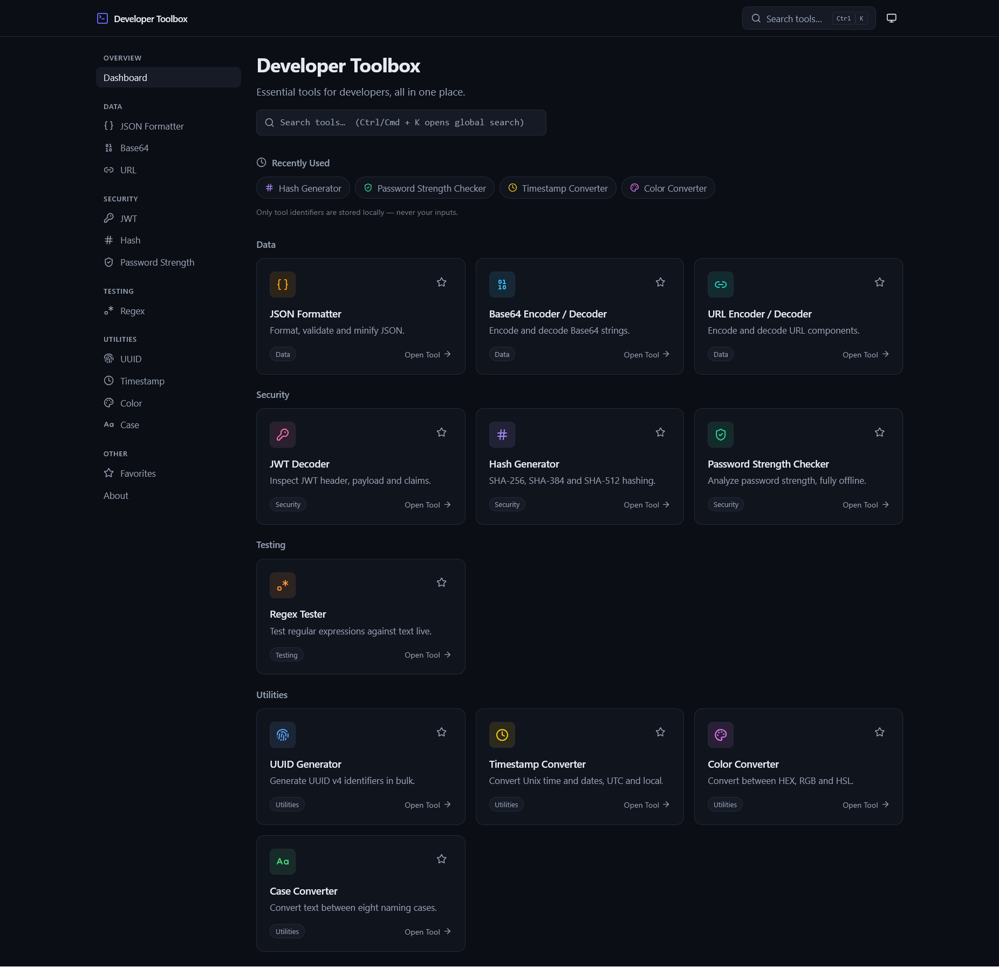

# Developer Toolbox

Essential tools for developers, all in one place. A fast, privacy-friendly collection of essential developer utilities that runs **entirely in your browser** — no backend, no accounts, no tracking.

## 🌐 Live Demo

[🚀 Open Developer Toolbox](https://alirezarajaee.github.io/developer-toolbox/)

## Features

All eleven tools run client-side:

| Category | Tool | What it does |
| --- | --- | --- |
| Data | **JSON Formatter** | Format, validate and minify JSON with line-aware error messages |
| Data | **Base64 Encoder / Decoder** | UTF-8-safe encode/decode with strict validation |
| Data | **URL Encoder / Decoder** | Percent-encode and decode URI components |
| Security | **JWT Decoder** | Inspect header, payload and claims (with human-readable dates) — decoding only, never signature verification |
| Security | **Hash Generator** | SHA-256 / SHA-384 / SHA-512 via the Web Crypto API |
| Security | **Password Strength Checker** | Local-only strength analysis with checks and warnings |
| Testing | **Regex Tester** | Live match highlighting, groups, counts and positions |
| Utilities | **UUID Generator** | Bulk UUID v4 generation via `crypto.randomUUID()` |
| Utilities | **Timestamp Converter** | Unix ⇄ date, UTC and local, relative formatting |
| Utilities | **Color Converter** | HEX ⇄ RGB ⇄ HSL with preview and native picker |
| Utilities | **Case Converter** | 8 naming cases with per-row copy |

Plus:

- Global search (`Ctrl/Cmd + K`) across tool names, descriptions and keywords
- Favorite tools (persisted locally)
- Recently used tools (only tool ids are stored — never inputs)
- Dark / light / system theme (dark by default)
- Fully responsive layout with a mobile drawer navigation
- Accessible: semantic HTML, keyboard navigation, visible focus states, ARIA labels

## Preview

<p align="center">
  
</p>

## Tech Stack

- [Next.js](https://nextjs.org/) (App Router, static export)
- [React](https://react.dev/)
- [TypeScript](https://www.typescriptlang.org/)
- [Tailwind CSS](https://tailwindcss.com/)
- [Lucide](https://lucide.dev/) icons

No backend, no database, no server runtime — the build produces plain static files.

## Getting Started

```bash
npm install
npm run dev
```

Open [http://localhost:3000](http://localhost:3000) in your browser.

## Production Build

```bash
npm run build
```

Next.js generates a fully static export in the `out/` directory (`output: 'export'` in `next.config.ts`).

To verify the production build locally **under the GitHub Pages base path** (recommended before deploying):

```bash
npm start
```

This serves `out/` at [http://localhost:4574/developer-toolbox/](http://localhost:4574/developer-toolbox/), mirroring how GitHub Pages will host it. Unknown paths serve the custom 404 page.

## Deployment

Deployment to GitHub Pages is automated with GitHub Actions (`.github/workflows/deploy.yml`):

1. Push your code to the `main` branch.
2. In your repository, go to **Settings → Pages** and set **Source** to **GitHub Actions**.
3. Every push to `main` triggers a workflow that installs dependencies, lints, builds the static export, and deploys the `out/` directory to GitHub Pages.

No manual upload is needed — `git push` is all it takes.

### Base path handling

The app is preconfigured to live under the `/developer-toolbox/` subpath that GitHub Pages uses for project sites. `next.config.ts` sets `basePath` and `assetPrefix` from `NEXT_PUBLIC_BASE_PATH` (defaulting to `/developer-toolbox`). All internal navigation uses Next.js `<Link>`, so routes resolve correctly under the subpath in both `next dev` and the production export.

## Privacy

- **Client-side only:** all tool logic (parsing, hashing, encoding, analysis) runs in your browser.
- **No data collection:** there are no analytics, trackers, or external APIs.
- **No sensitive storage:** localStorage holds only your theme preference, favorite tool ids, and recently used tool ids. Passwords, JWTs, and tool inputs are never stored, logged, or transmitted.

## Project Structure

```text
src/
  app/                  # Routes (dashboard, /about, /favorites, /tools/*)
    tools/
      json/ base64/ url/ jwt/ hash/ password/ regex/ uuid/ timestamp/ color/ case/
  components/
    layout/             # App shell, header
    sidebar/            # Categorized navigation
    search/             # Global search palette (Ctrl/Cmd + K)
    tool-card/          # Dashboard cards
    tool-layout/        # Shared tool page scaffold + visit tracking
    theme/              # Theme provider + toggle
    favorite-button/    # Favorite star (localStorage)
    ui/                 # Button, inputs, alert, copy button, kbd
  lib/
    tools.ts            # Single source of truth: tool registry & search
    converters.ts       # Pure color/case/password logic
    json.ts             # JSON parse/format with error positions
    base64url.ts        # Base64url decoding for JWT
    site.ts             # Site config (repo URL, tagline, version)
    hooks/              # useLocalStorage, favorites, recently used
  types/                # Shared types
```

Business logic (parsing, conversion, analysis) lives in `src/lib` and is kept separate from the UI components in `src/components` and routes in `src/app`.

## Roadmap

Possible future tools (not implemented yet):

- [ ] Cron expression parser / explainer
- [ ] Text diff viewer
- [ ] JSON ⇄ YAML converter
- [ ] Lorem ipsum generator
- [ ] HTML entity encoder/decoder
- [ ] Image to Base64 converter

## License

[MIT](LICENSE)
